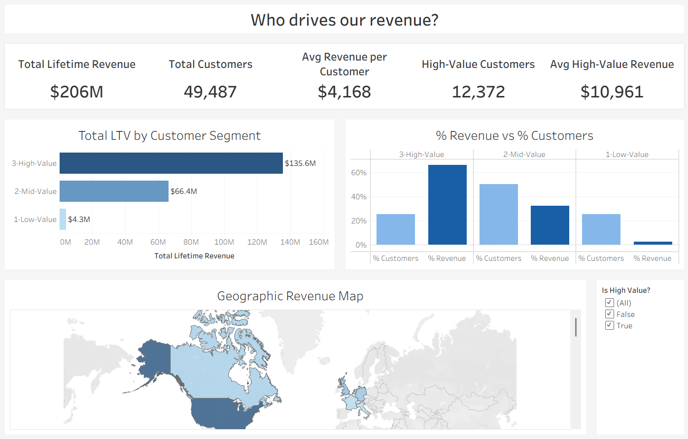
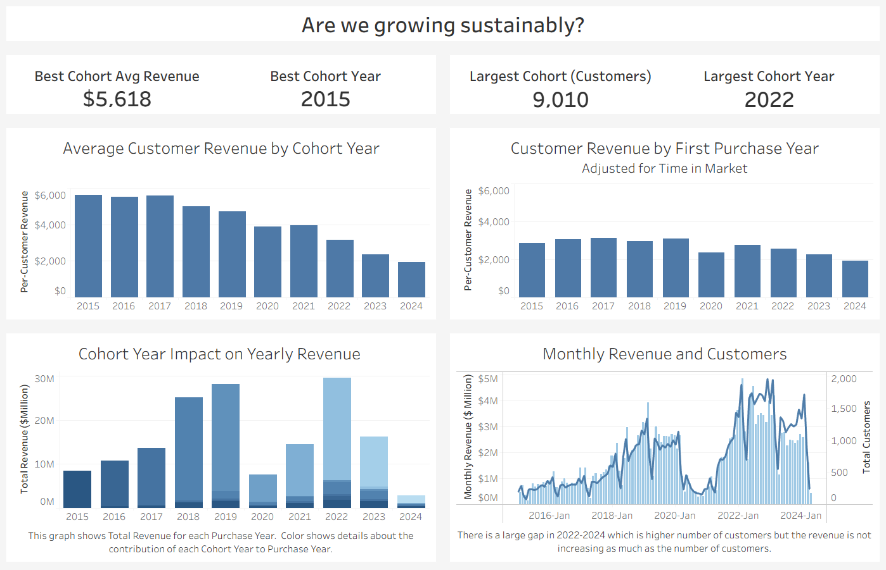
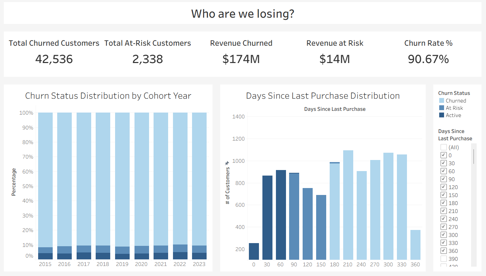

# Customer Analysis Dashboard w/ Tableau

> <a href="https://public.tableau.com/views/ContosoDashboards_17763863673810/CustomerSegmentation?:language=en-US&:sid=&:redirect=auth&:display_count=n&:origin=viz_share_link" target="_blank">
📊 View interactive dashboards here on the Tableau Public</a>

---

## Introduction
This project analyzes **10 years of sales data (2015-2024)** for Contoso, an e-commerce company across multiple continents. The analysis uncovers the trends in customer value, revenue generation, and churn risk and delivers strategic recommendations for marketing, sales and production teams.

### Dashboard File
You can find the file for the dashboards here:
[Customer_Analysis_Tableau_Dashboards.twb](customer_analysis_tableau_dashboard.twb).

---

## Business Questions

1. **Customer Segmentation:** Who are our most valuable customers?
2. **Cohort Analysis:** How do different customer groups generate revenue over time?
3. **Retention & Churn Analysis:** Which customers haven't purchased recently and who is at risk?

---

## Skills Showcased

### SQL (PostgresSQL)
- **CTEs (Common Table Expressions):** Multi-step analytical logic broken into readable, reusable building blocks
- **Window Functions:**  `RANK()`, `PARTITION BY`, `MIN() OVER()` for row-level calculations without collapsing data
- **Statistical Aggregation:** `percentile_cont()` for threshold-based customer segmentation
- **Currency Normalization:** Multi-currency revenue standardized to USD using daily exchange rates at time of purchase
- **Date Arithmetic:** `EXTRACT(YEAR FROM ...)`, `DATE_TRUNC('month', ...)`, interval-based churn thresholds
- **View Creation:** Three persistent PostgreSQL views feeding directly into Tableau as data sources

### Tableau
- **Multiple Data Sources:** Four standalone CSV data sources connected independently to prevent join errors
- **Calculated Fields:** Conditional aggregations using `IF/THEN` inside `SUM()` and `COUNTD()` to display segment-level KPIs without filtering the entire sheet
- **LOD Expressions:** Fixed Level of Detail calculations for cross-cohort comparisons
- **Dual-Axis Charts:** Customer count line and monthtly revenue bar on a shared axis for the monthly trend chart
- **Table Calculations:** `Percent of Total` for the % Revenue vs % Customers comparison
- **Dashboard Actions:** Filter actions connecting charts across the same dashboard
- **Bin Creation:** Custom 30-day bins on `Days Since Last Purchase` for the churn histogram
- **Geographic Role Assignment:** `Countryfull` mapped to Country/Region for the revenue map

---

## Dashboard Overview
*Three dashboards tell the complete customer story — from who is valuable, to how cohorts perform over time, to who the business is losing.*

---

### Dashboard 1 — Customer Segmentation Analysis

Question: **Who are our most valuable customers?**

**Key KPIs:** Total Revenue · Total Customers · High-Value Customer Count · Avg Revenue per Customer · High-Value Avg Revenue

**Charts:**
- Revenue distribution by segment (Absolute $ bar chart)
- % of Customers vs % of Revenue side-by-side comparison
- Geographic revenue map filtered by customer segment

📊 **Key Findings:**
- The top 25% of customers (High-Value segment) generate **66% of total revenue (~$135.6M)**
- The bottom 25% of customers (Low-Value) generate only **2% of revenue (~$4.3M)**
- High-Value customers are concentrated in North America, Australia, and Europe

💡 **Business Insights:** 
- Revenue is highly concentrated. 
- Losing even 5% of High-Value customers costs more than the entire Low-Value segment generates. 
- A VIP loyalty program targeting these 12,372 customers should be the first priority.

---

### Dashboard 2 — Cohort Analysis

Questions: **Are newer customers worth as much as older ones, and where is revenue coming from each year?**

**Key KPIs:** Best Cohort Avg Revenue · Best Cohort Year · Largest Cohort Size · Largest Cohort Year

**Charts:**
- Average customer revenue by cohort year (Unadjusted)
- Customer revenue by first purchase year — Adjusted for time in market
- Cohort year impact on yearly net revenue (Stacked bar by purchase year)
- Monthly revenue and customer count trend (Dual-axis)

📊 **Key Findings:**
- Revenue per customer (Unadjusted) has **declined 65%** from $5,618 (2015 cohort) to $1,941 (2024 cohort)
- This decline holds even after adjusting for time in market — newer cohorts are intrinsically less valuable, not just younger
- 2020 saw a dramatic drop in new customer acquisition, likely reflecting COVID-19 impact on store traffic
- 2022 was the peak acquisition year (9,010 customers) but with the relatively low per-customer value at that point
- Each year's revenue is almost entirely driven by that year's new cohort — older cohorts contribute tiny slivers, confirming low retention

Note that: The dataset was collected until April 2024

💡 **Business Insights:** 
- The business is on a treadmill — total revenue is maintained only by continuously acquiring new customers because existing ones do not return. 
- Both acquisition quality and retention are declining simultaneously, creating compounding revenue risk.

---

### Dashboard 3 — Retention & Churn Analysis

Questions: **How many customers have churned, who is at risk right now, and how much revenue is at stake?**

**Churn definition:**
- A customer is Churned if they have not purchased in **180+ days** (6 months). 
- At Risk = 90–180 days inactive. 
- Customers acquired within the last 6 months are excluded from churn calculations.

**Key KPIs:** Total Churned · Total At-Risk · Revenue Churned · Revenue at Risk · Churn Rate %

**Charts:**
- Churn status distribution by cohort year (100% stacked bar — Active / At Risk / Churned)
- Days since last purchase histogram (30-day bins, color-coded by churn status)

📊 **Key Findings:**
- Churn rate is approximately **91%** across all cohorts — the vast majority of customers never return after their first year
- $174M of the $206M Total LTV (84%) came from customers who have churned - indicating that the business has almost no active loyal customer base
- Churn is **systemic** — consistent across all cohorts and years, meaning it is a structural problem not tied to any specific event or year
- At-Risk customers (90–180 days inactive) represent an active intervention window before permanent churn
- Older cohorts (2015–2019) have higher churned revenue per customer because those customers had higher lifetime value before churning

💡 **Business Insights:** 
- Re-engaging churned High-Value customers delivers far higher ROI than acquiring new Low-Value customers. 
- A win-back list targeting At-Risk and Churned High-Value customers sorted by lifetime revenue is available in [win_back_list.csv](win_back_list.csv).

---

## Conclusions

**1. Customer Value Optimization** (Customer Segmentation)
- Launch VIP loyalty program for 12,372 high-value customers as they are carrying the majority of the business revenue
- Offer early access to new products or free shipping to top 25% of customers

**2. Cohort Performance Strategy** (Customer Revenue by Cohort)
- Investigate what have changed in acquisition or product quality from 2022 onward
- Apply successful strategies from high-performing 2016-2018 cohorts to newer customers

**3. Retention & Churn Prevention** (Customer Retention)
- Prioritize At-Risk High-Value Customers to retain them before they decide to churn
- The ROI of reactivating one high-value customer is much higher than acquiring 10 new low-value customers 
